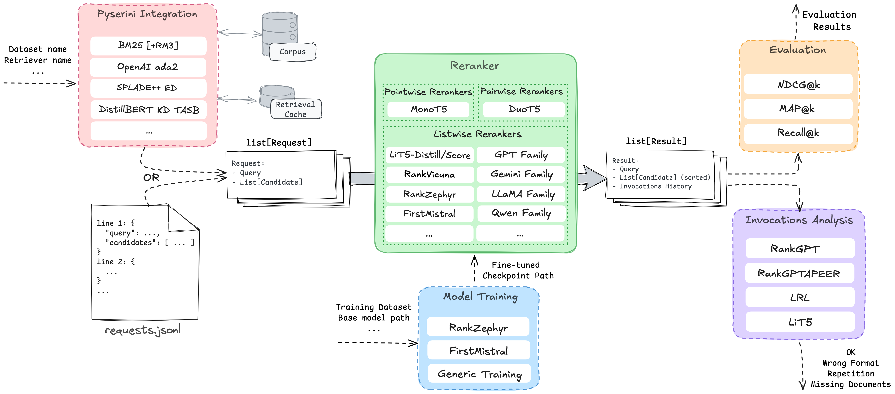

# RankLLM

[](https://pypi.org/project/rank-llm/)
[](https://pepy.tech/project/rank-llm)
[](https://pepy.tech/project/rank-llm)
[](https://arxiv.org/abs/2309.15088)
[](https://www.apache.org/licenses/LICENSE-2.0)

## News
- **[2025/05/25]** Our [RankLLM](https://dl.acm.org/doi/pdf/10.1145/3726302.3730331) resource paper is accepted to SIGIR 2025! 🎉🎉🎉

## Overview
We offer a suite of rerankers - pointwise models like MonoT5, pairwise models like DuoT5 and listwise models with a focus on open source LLMs compatible with [vLLM](https://https://github.com/vllm-project/vllm), [SGLang](https://github.com/sgl-project/sglang), or [TensorRT-LLM](https://github.com/NVIDIA/TensorRT-LLM). We also support RankGPT and RankGemini variants, which are proprietary listwise rerankers. Addtionally, we support reranking with the first-token logits only to improve inference efficiency.  Some of the code in this repository is borrowed from [RankGPT](https://github.com/sunnweiwei/RankGPT), [PyGaggle](https://github.com/castorini/pygaggle), and [LiT5](https://github.com/castorini/LiT5)!

<p align="center">

</p>

## Releases
current_version = 0.25.4

## Content
1. [Installation](#installation)
2. [Quick Start](#quick-start)
3. [End-to-end Run and 2CR](#end-to-end-run-and-2cr)
4. [Model Zoo](#model-zoo)
5. [Training](#training)
6. [Community Contribution](#community-contribution)
7. [References and Citations](#references)
8. [Acknowledgments](#acknowledgments)

<a id="installation"></a>
# 📟 Installation

> **⚠️ RankLLM is not compatible with macOS**, regardless of whether you are using an Intel-based Mac or Apple Silicon (M-series). We recommend using Linux or Windows instead.

## ❗ JDK 21 Warning

As rank_llm relies on [Anserini](https://github.com/castorini/anserini), it is required that you have JDK 21 installed.
Please note that using JDK 11 is not supported and may lead to errors.

## Create Conda Environment

```bash
conda create -n rankllm python=3.11
conda activate rankllm
```

## Install Pytorch with CUDA (Windows/Linux)
```bash
pip3 install torch torchvision torchaudio --index-url https://download.pytorch.org/whl/cu121
```

## Install OpenJDK with Maven if you want to use the retriever
```bash
conda install -c conda-forge openjdk=21 maven -y
```

### Install retriever dependencies if you want to use the retriever
```bash
pip install "rank-llm[pyserini]"
```

## Install [all] Dependencies
```bash
pip install -e .[all]      # local installation for development
pip install rank-llm[all]  # or pip installation
```

## Install SGLang, or TensorRT-LLM (Optional)

### Install SGLang (Optional)

```bash
pip install -e .[sglang]      # local installation for development
pip install rank-llm[sglang]  # or pip installation
```

Remember to install flashinfer to use `SGLang` backend.

```bash
pip install flashinfer -i https://flashinfer.ai/whl/cu121/torch2.4/
```

### TensorRT-LLM

```bash
pip install -e .[tensorrt-llm]      # local installation for development
pip install rank-llm[tensorrt-llm]  # or pip installation
```

## Install Training (Optional)

```bash
pip install -e .[training]      # local installation for development
pip install rank-llm[training]  # or pip installation
```

Remember to also install flash-attn to use as optimized implementation of attention mechanism used in Transformer models.

```bash
pip install flash-attn --no-build-isolation
```

<a id="quick-start"></a>
# ⏳ Quick Start
The following code snippet is a minimal walk through of retrieval, reranking, evalaution, and invocations analysis of top 100 retrieved documents for queries from `DL19`. In this example `BM25` is used as the retriever and `RankZephyr` as the reranker. Additional sample snippets are available to run under the `src/rank_llm/demo` directory.
```python
from pathlib import Path

from rank_llm.analysis.response_analysis import ResponseAnalyzer
from rank_llm.data import DataWriter
from rank_llm.evaluation.trec_eval import EvalFunction
from rank_llm.rerank import Reranker, get_openai_api_key
from rank_llm.rerank.listwise import (
    SafeOpenai,
    VicunaReranker,
    ZephyrReranker,
)
from rank_llm.retrieve.retriever import RetrievalMethod, Retriever
from rank_llm.retrieve.topics_dict import TOPICS

# -------- Retrieval --------

# By default BM25 is used for retrieval of top 100 candidates.
dataset_name = "dl19"
retrieved_results = Retriever.from_dataset_with_prebuilt_index(dataset_name)

# Users can specify other retrieval methods and number of retrieved candidates.
# retrieved_results = Retriever.from_dataset_with_prebuilt_index(
#     dataset_name, RetrievalMethod.SPLADE_P_P_ENSEMBLE_DISTIL, k=50
# )
# ---------------------------

# --------- Rerank ----------

# Rank Zephyr model
reranker = ZephyrReranker()

# Rank Vicuna model
# reranker = VicunaReranker()

# RankGPT
# model_coordinator = SafeOpenai("gpt-4o-mini", 4096, keys=get_openai_api_key())
# reranker = Reranker(model_coordinator)

kwargs = {"populate_invocations_history": True}
rerank_results = reranker.rerank_batch(requests=retrieved_results, **kwargs)
# ---------------------------

# ------- Evaluation --------

# Evaluate retrieved results.
topics = TOPICS[dataset_name]
ndcg_10_retrieved = EvalFunction.from_results(retrieved_results, topics)
print(ndcg_10_retrieved)

# Evaluate rerank results.
ndcg_10_rerank = EvalFunction.from_results(rerank_results, topics)
print(ndcg_10_rerank)

# By default ndcg@10 is the eval metric, other value can be specified:
# eval_args = ["-c", "-m", "map_cut.100", "-l2"]
# map_100_rerank = EvalFunction.from_results(rerank_results, topics, eval_args)
# print(map_100_rerank)

# eval_args = ["-c", "-m", "recall.20"]
# recall_20_rerank = EvalFunction.from_results(rerank_results, topics, eval_args)
# print(recall_20_rerank)

# ---------------------------

# --- Analyze invocations ---
analyzer = ResponseAnalyzer.from_inline_results(rerank_results)
error_counts = analyzer.count_errors(verbose=True)
print(error_counts)
# ---------------------------

# ------ Save results -------
writer = DataWriter(rerank_results)
Path(f"demo_outputs/").mkdir(parents=True, exist_ok=True)
writer.write_in_jsonl_format(f"demo_outputs/rerank_results.jsonl")
writer.write_in_trec_eval_format(f"demo_outputs/rerank_results.txt")
writer.write_inference_invocations_history(
    f"demo_outputs/inference_invocations_history.json"
)
# ---------------------------
```

# End-to-end Run and 2CR
If you are interested in running retrieval and reranking end-to-end or reproducing the results from the [reference papers](#✨-references), `run_rank_llm.py` is a convinent wrapper script that combines these two steps.

The comperehensive list of our two-click reproduction commands are available on [MS MARCO V1](https://castorini.github.io/rank_llm/src/rank_llm/2cr/msmarco-v1-passage.html) and [MS MARCO V2](https://castorini.github.io/rank_llm/src/rank_llm/2cr/msmarco-v2-passage.html) webpages for DL19 and DL20 and DL21-23 datasets, respectively. Moving forward, we plan to cover more datasets and retrievers in our 2CR pages. The rest of this session provides some sample e2e runs. 
## RankZephyr

We can run the RankZephyr model with the following command:
```bash
python src/rank_llm/scripts/run_rank_llm.py  --model_path=castorini/rank_zephyr_7b_v1_full --top_k_candidates=100 --dataset=dl20 \
--retrieval_method=SPLADE++_EnsembleDistil_ONNX --prompt_template_path=src/rank_llm/rerank/prompt_templates/rank_zephyr_template.yaml  --context_size=4096 --variable_passages
```

Including the `--sglang_batched` flag will allow you to run the model in batched mode using the `SGLang` library.

Including the `--tensorrt_batched` flag will allow you to run the model in batched mode using the `TensorRT-LLM` library.

If you want to run multiple passes of the model, you can use the `--num_passes` flag.

## RankGPT4-o

We can run the RankGPT4-o model with the following command:
```bash
python src/rank_llm/scripts/run_rank_llm.py  --model_path=gpt-4o --top_k_candidates=100 --dataset=dl20 \
  --retrieval_method=bm25 --prompt_template_path=src/rank_llm/rerank/prompt_templates/rank_gpt_apeer_template.yaml  --context_size=4096 --use_azure_openai
```
Note that the `--prompt_template_path` is set to `rank_gpt_apeer` to use the LLM refined prompt from [APEER](https://arxiv.org/abs/2406.14449).
This can be changed to `rank_GPT` to use the original prompt.

## LiT5

We can run the LiT5-Distill V2 model (which could rerank 100 documents in a single pass) with the following command:

```bash
python src/rank_llm/scripts/run_rank_llm.py  --model_path=castorini/LiT5-Distill-large-v2 --top_k_candidates=100 --dataset=dl19 \
        --retrieval_method=bm25 --prompt_template_path=src/rank_llm/rerank/prompt_templates/rank_fid_template.yaml  --context_size=150 --batch_size=4 \
    --variable_passages --window_size=100
```

We can run the LiT5-Distill original model (which works with a window size of 20) with the following command:

```bash
python src/rank_llm/scripts/run_rank_llm.py  --model_path=castorini/LiT5-Distill-large --top_k_candidates=100 --dataset=dl19 \
    --retrieval_method=bm25 --prompt_template_path=src/rank_llm/rerank/prompt_templates/rank_fid_template.yaml  --context_size=150 --batch_size=32 \
    --variable_passages
```

We can run the LiT5-Score model with the following command:

```bash
python src/rank_llm/scripts/run_rank_llm.py  --model_path=castorini/LiT5-Score-large --top_k_candidates=100 --dataset=dl19 \
    --retrieval_method=bm25 --prompt_template_path=src/rank_llm/rerank/prompt_templates/rank_fid_score_template.yaml --context_size=150 --batch_size=8 \
    --window_size=100 --variable_passages
```

## MonoT5

The following runs the 3B variant of MonoT5 trained for 10K steps:

```bash
python src/rank_llm/scripts/run_rank_llm.py --model_path=castorini/monot5-3b-msmarco-10k --top_k_candidates=1000 --dataset=dl19 \
    --retrieval_method=bm25 --prompt_template_path=src/rank_llm/rerank/prompt_templates/monot5_template.yaml --context_size=512
```

Note that we usually rerank 1K candidates with MonoT5.

## DuoT5
The following runs the #B variant of DuoT5 trained for 10K steps:
```bash
python src/rank_llm/scripts/run_rank_llm.py --model_path=castorini/duot5-3b-msmarco-10k --top_k_candidates=50 --dataset=dl19 \
    --retrieval_method=bm25 --prompt_template_path=src/rank_llm/rerank/prompt_templates/duot5_template.yaml
```

Since Duo's pairwise comparison has $O(n^2) runtime complexity, we recommend reranking top 50 candidates using DuoT5 models.

## FirstMistral

We can run the FirstMistral model, reranking using the first-token logits only with the following command:

```
python src/rank_llm/scripts/run_rank_llm.py  --model_path=castorini/first_mistral --top_k_candidates=100 --dataset=dl20 --retrieval_method=SPLADE++_EnsembleDistil_ONNX --prompt_template_path=src/rank_llm/rerank/prompt_templates/rank_zephyr_template.yaml  --context_size=4096 --variable_passages --use_logits --use_alpha --num_gpus 1
```

Omit `--use_logits` if you wish to perform traditional listwise reranking.

## Gemini Flash 2.0

First install genai:

```bash
pip install -e .[genai]      # local installation for development
pip install rank-llm[genai]  # or pip installation
```

Then run the following command:

```bash
python src/rank_llm/scripts/run_rank_llm.py  --model_path=gemini-2.0-flash-001 --top_k_candidates=100 --dataset=dl20 \
    --retrieval_method=SPLADE++_EnsembleDistil_ONNX --prompt_template_path=src/rank_llm/rerank/prompt_templates/rank_gpt_apeer_template.yaml  --context_size=4096
```

<a id="model-zoo"></a>
# 🦙🐧 Model Zoo

The following is a table of the listwise models our repository was primarily built to handle (with the models hosted on HuggingFace):

`vLLM`, `SGLang`, and `TensorRT-LLM` backends are only supported for `RankZephyr` and `RankVicuna` models.

| Model Name        | Hugging Face Identifier/Link                            |
|-------------------|---------------------------------------------|
| RankZephyr 7B V1 - Full - BF16      | [castorini/rank_zephyr_7b_v1_full](https://huggingface.co/castorini/rank_zephyr_7b_v1_full)               |
| RankVicuna 7B - V1      | [castorini/rank_vicuna_7b_v1](https://huggingface.co/castorini/rank_vicuna_7b_v1)               |
| RankVicuna 7B - V1 - No Data Augmentation    | [castorini/rank_vicuna_7b_v1_noda](https://huggingface.co/castorini/rank_vicuna_7b_v1_noda)               |
| RankVicuna 7B - V1 - FP16      | [castorini/rank_vicuna_7b_v1_fp16](https://huggingface.co/castorini/rank_vicuna_7b_v1_fp16)               |
| RankVicuna 7B - V1 - No Data Augmentation - FP16   | [castorini/rank_vicuna_7b_v1_noda_fp16](https://huggingface.co/castorini/rank_vicuna_7b_v1_noda_fp16)               |

We also officially support the following rerankers built by our group:

## LiT5 Suite

The following is a table specifically for our LiT5 suite of models hosted on HuggingFace:

| Model Name            | 🤗 Hugging Face Identifier/Link                            |
|-----------------------|---------------------------------------------|
| LiT5 Distill base     | [castorini/LiT5-Distill-base](https://huggingface.co/castorini/LiT5-Distill-base)          |
| LiT5 Distill large    | [castorini/LiT5-Distill-large](https://huggingface.co/castorini/LiT5-Distill-large)        |
| LiT5 Distill xl       | [castorini/LiT5-Distill-xl](https://huggingface.co/castorini/LiT5-Distill-xl)              |
| LiT5 Distill base v2  | [castorini/LiT5-Distill-base-v2](https://huggingface.co/castorini/LiT5-Distill-base-v2)    |
| LiT5 Distill large v2 | [castorini/LiT5-Distill-large-v2](https://huggingface.co/castorini/LiT5-Distill-large-v2)  |
| LiT5 Distill xl v2    | [castorini/LiT5-Distill-xl-v2](https://huggingface.co/castorini/LiT5-Distill-xl-v2)        |
| LiT5 Score base       | [castorini/LiT5-Score-base](https://huggingface.co/castorini/LiT5-Score-base)              |
| LiT5 Score large      | [castorini/LiT5-Score-large](https://huggingface.co/castorini/LiT5-Score-large)            |
| LiT5 Score xl         | [castorini/LiT5-Score-xl](https://huggingface.co/castorini/LiT5-Score-xl)                  |

Now you can run top-100 reranking with the v2 model in a single pass while maintaining efficiency!

## MonoT5 Suite - Pointwise Rerankers

The following is a table specifically for our monoT5 suite of models hosted on HuggingFace:

| Model Name                        | 🤗 Hugging Face Identifier/Link                            |
|-----------------------------------|--------------------------------------------------------|
| monoT5 Small MSMARCO 10K          | [castorini/monot5-small-msmarco-10k](https://huggingface.co/castorini/monot5-small-msmarco-10k)       |
| monoT5 Small MSMARCO 100K         | [castorini/monot5-small-msmarco-100k](https://huggingface.co/castorini/monot5-small-msmarco-100k)     |
| monoT5 Base MSMARCO               | [castorini/monot5-base-msmarco](https://huggingface.co/castorini/monot5-base-msmarco)                 |
| monoT5 Base MSMARCO 10K           | [castorini/monot5-base-msmarco-10k](https://huggingface.co/castorini/monot5-base-msmarco-10k)         |
| monoT5 Large MSMARCO 10K          | [castorini/monot5-large-msmarco-10k](https://huggingface.co/castorini/monot5-large-msmarco-10k)       |
| monoT5 Large MSMARCO              | [castorini/monot5-large-msmarco](https://huggingface.co/castorini/monot5-large-msmarco)               |
| monoT5 3B MSMARCO 10K             | [castorini/monot5-3b-msmarco-10k](https://huggingface.co/castorini/monot5-3b-msmarco-10k)             |
| monoT5 3B MSMARCO                 | [castorini/monot5-3b-msmarco](https://huggingface.co/castorini/monot5-3b-msmarco)                     |
| monoT5 Base Med MSMARCO           | [castorini/monot5-base-med-msmarco](https://huggingface.co/castorini/monot5-base-med-msmarco)         |
| monoT5 3B Med MSMARCO             | [castorini/monot5-3b-med-msmarco](https://huggingface.co/castorini/monot5-3b-med-msmarco)             |

We recommend the Med models for biomedical retrieval. We also provide both 10K (generally better OOD effectiveness) and 100K checkpoints (better in-domain).
# Training
Please check the `training` directory for finetuning open-source listwise rerankers.
# External Integrations
RankLLM is implemented in many popular toolkits such as LlamaIndex, rerankers, and LangChain. For usage of RankLLM in those toolkits and examples, please check this external integrations [README](docs/external-integrations.md)
# Community Contribution
If you would like to contribute to the project, please refer to the [contribution guidelines](CONTRIBUTING.md).

## 📜️ Release History

+ v0.25.4: July 23, 2025 [[Release Notes](docs/release-notes/release-notes-v0.25.0.md)]

<a id=references></a>
# ✨ References

If you use RankLLM, please cite the following relevant papers:

[[2505.19284] RankLLM: A Python Package for Reranking with LLMs](https://dl.acm.org/doi/10.1145/3726302.3730331)

<!--  -->
```
@inproceedings{sharifymoghaddam2025rankllm,
author = {Sharifymoghaddam, Sahel and Pradeep, Ronak and Slavescu, Andre and Nguyen, Ryan and Xu, Andrew and Chen, Zijian and Zhang, Yilin and Chen, Yidi and Xian, Jasper and Lin, Jimmy},
title = {{RankLLM}: A Python Package for Reranking with LLMs},
year = {2025},
isbn = {9798400715921},
publisher = {Association for Computing Machinery},
address = {New York, NY, USA},
booktitle = {Proceedings of the 48th International ACM SIGIR Conference on Research and Development in Information Retrieval},
pages = {3681–3690},
numpages = {10},
keywords = {information retrieval, large language models, python, reranking},
location = {Padua, Italy},
series = {SIGIR '25}
}
```
<!--  -->

[[2309.15088] RankVicuna: Zero-Shot Listwise Document Reranking with Open-Source Large Language Models](https://arxiv.org/abs/2309.15088)

<!--  -->
```
@ARTICLE{pradeep2023rankvicuna,
  title   = {{RankVicuna}: Zero-Shot Listwise Document Reranking with Open-Source Large Language Models},
  author  = {Ronak Pradeep and Sahel Sharifymoghaddam and Jimmy Lin},
  year    = {2023},
  journal = {arXiv:2309.15088}
}
```
<!--  -->


[[2312.02724] RankZephyr: Effective and Robust Zero-Shot Listwise Reranking is a Breeze!](https://arxiv.org/abs/2312.02724)

<!--  -->
```
@ARTICLE{pradeep2023rankzephyr,
  title   = {{RankZephyr}: Effective and Robust Zero-Shot Listwise Reranking is a Breeze!},
  author  = {Ronak Pradeep and Sahel Sharifymoghaddam and Jimmy Lin},
  year    = {2023},
  journal = {arXiv:2312.02724}
}
```
<!--  -->

If you use one of the LiT5 models please cite the following relevant paper:

[[2312.16098] Scaling Down, LiTting Up: Efficient Zero-Shot Listwise Reranking with Seq2seq Encoder-Decoder Models](https://arxiv.org/abs/2312.16098)

```
@ARTICLE{tamber2023scaling,
  title   = {Scaling Down, LiTting Up: Efficient Zero-Shot Listwise Reranking with Seq2seq Encoder-Decoder Models},
  author  = {Manveer Singh Tamber and Ronak Pradeep and Jimmy Lin},
  year    = {2023},
  journal = {arXiv:2312.16098}
}
```

If you use one of the monoT5 models please cite the following relevant paper:

[[2101.05667] The Expando-Mono-Duo Design Pattern for Text Ranking with Pretrained Sequence-to-Sequence Models](https://arxiv.org/abs/2101.05667)

```
@ARTICLE{pradeep2021emd,
  title = {The Expando-Mono-Duo Design Pattern for Text Ranking with Pretrained Sequence-to-Sequence Models},
  author = {Ronak Pradeep and Rodrigo Nogueira and Jimmy Lin},
  year = {2021},
  journal = {arXiv:2101.05667},
}
```

If you use the FirstMistral model, please consider citing:

[[2411.05508] An Early FIRST Reproduction and Improvements to Single-Token Decoding for Fast Listwise Reranking](https://arxiv.org/abs/2411.05508)

```
@ARTICLE{chen2024firstrepro,
  title   = title={An Early FIRST Reproduction and Improvements to Single-Token Decoding for Fast Listwise Reranking},
  author  = {Zijian Chen and Ronak Pradeep and Jimmy Lin},
  year    = {2024},
  journal = {arXiv:2411.05508}
}
```

If you would like to cite the FIRST methodology, please consider citing:

[[2406.15657] FIRST: Faster Improved Listwise Reranking with Single Token Decoding](https://arxiv.org/abs/2406.15657)

```
@ARTICLE{reddy2024first,
  title   = {FIRST: Faster Improved Listwise Reranking with Single Token Decoding},
  author  = {Reddy, Revanth Gangi and Doo, JaeHyeok and Xu, Yifei and Sultan, Md Arafat and Swain, Deevya and Sil, Avirup and Ji, Heng},
  year    = {2024}
  journal = {arXiv:2406.15657},
}
```
<a id=acknowledgments></a>
# 🙏 Acknowledgments

This research is supported in part by the Natural Sciences and Engineering Research Council (NSERC) of Canada.
